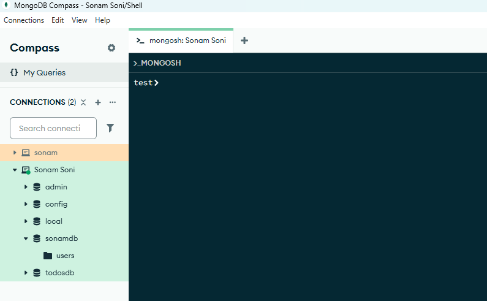

# SQL vs No SQL

1. SQL (Relational Data) - just like Excel Sheet
    - Fixed columns and strict Structure

2. NoSQL (MongoDB) - Like Notebook sticky notes - flexible
    - each page can have diffrent Data
    - used for BigData

```json
{
    "name":"Sonam Soni",
    "age":27,
    "courses":["MongoDB","MySQL"]
}
```
- database (Company)
- collection: Employee, Department
- document: 1 record consider 1 doc

**Database -> Collection + Document**

**JSON(javascript object Notation)**

- key-value pairs
- String, numbers, arrays, objects, nested objects, nested arrays
- easy to read in any languaged

## Download and Setup MongoDB Server
[Download From Here](https://www.mongodb.com/try/download/community)

- Select package
- select version (current)
- select OS
- select msi

- double click on .msi file continue with basic steps and just say next and install.
- go with default installation steps
- Once this installation completed successfully it will ask you to install MongoDB Compass.

**Mac Users**

```bash
brew install mongodb-community@7.0

brew service start mongodb-community@7.0
```

**Install In Ubuntu**

[Link for ubuntu Installation](https://www.mongodb.com/docs/v7.0/tutorial/install-mongodb-on-ubuntu/)

*DB Connect*


- once its is connected 
- select any Db and on the top of that
- check for access mongoDB shell
- click on that, you can access shell like this



**Run Queries**

```bash
#Create Database
use letsupgrade
# Create Collection
db.createCollection("employee")
# Insert One Record
db.employee.insertOne({
    "name":"Sonam Soni",
    "age":28,
    "department":"IT",
    "designation":"Software Engineer",
    "skills":["JAVA","Python","MongoDB","MySQL"]
})

# See the inserted Records
db.employee.find()

# Insert Many Records
db.employee.insertMany([
  {
    name: "Amit Sharma",
    age: 28,
    department: "IT",
    designation: "Software Engineer",
    salary: 75000,
    skills: ["JavaScript", "React", "Node.js"]
  },
  {
    name: "Neha Verma",
    age: 32,
    department: "HR",
    designation: "HR Manager",
    salary: 65000,
    skills: ["Recruitment", "Training"]
  },
  {
    name: "Ravi Patel",
    age: 26,
    department: "Sales",
    designation: "Sales Executive",
    salary: 55000,
    skills: ["Negotiation", "Communication"]
  }
])

# Find all
db.employee.find()
```

**Use MongoDB Online if installation is not working**

[MongoDB Online](https://onecompiler.com/mongodb/3yx5kv6bk)
